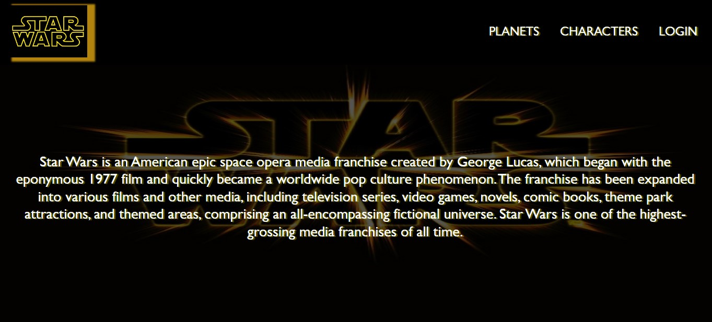
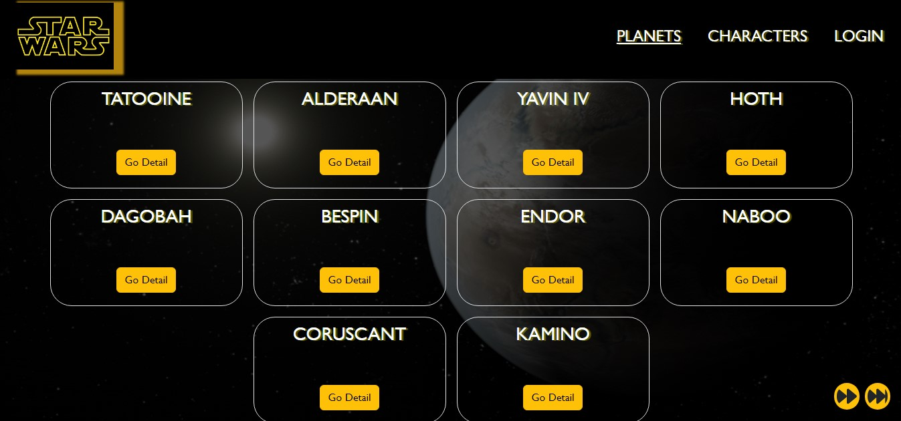
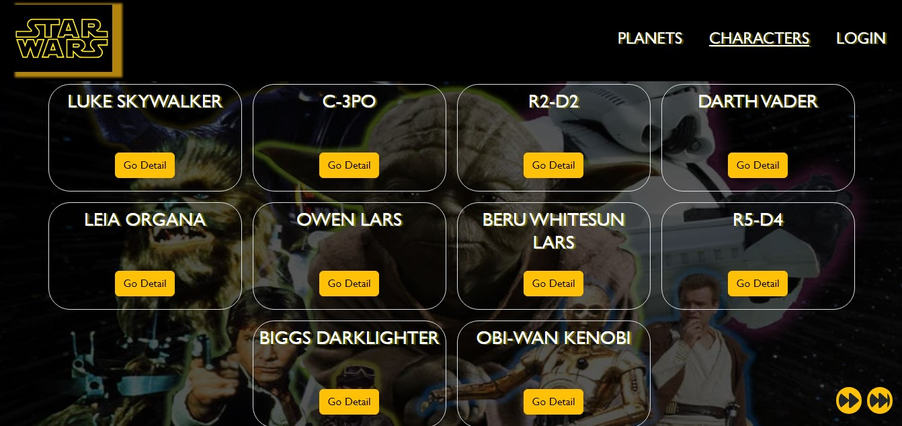
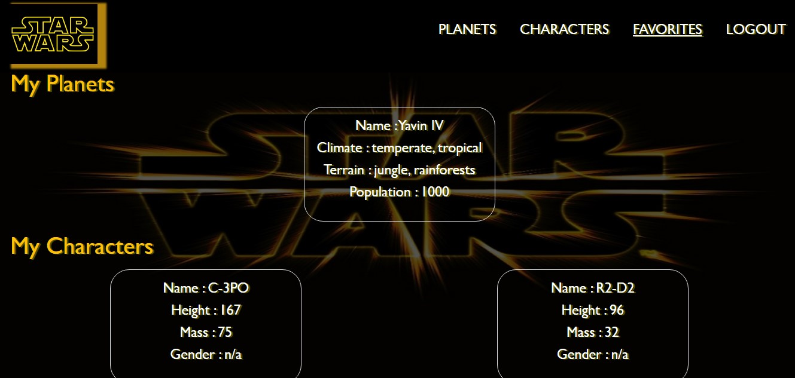
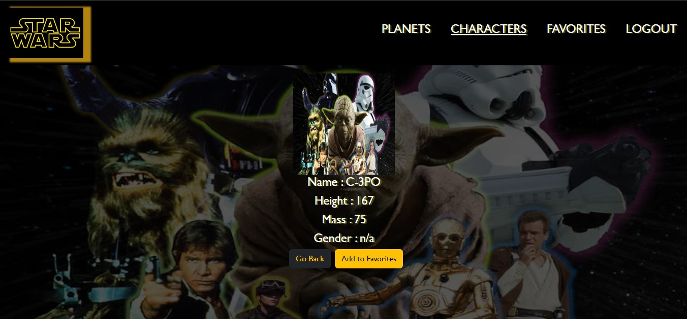

# starWars-frontend

StarWarsApp is a project that you can see planets and characters of Star Wars movies. Then you can see detail of planet and characters and add to favorites. And this repo is the frontend side of the project. To see the backend repo you can visit [starWars-backend.](https://github.com/Hasan-Turkel/starWars-backend)  

## [Click to see live link.](https://star-wars-frontend-ten.vercel.app/)

## This is how the site looks like.

